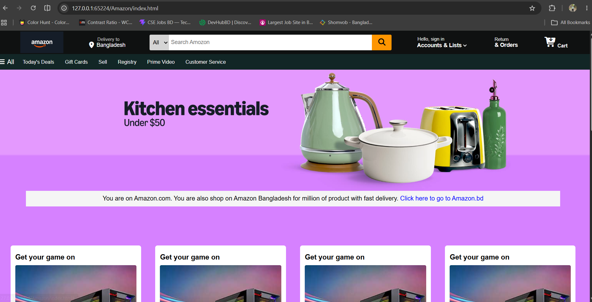
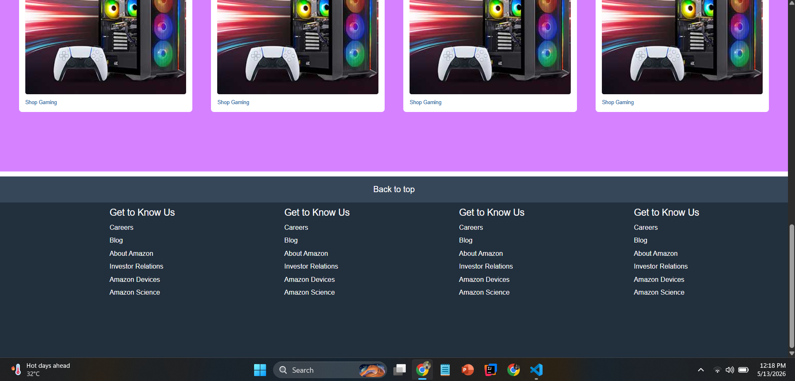

# 🛒 Amazon Website Clone (HTML & CSS)

This project is a simple front-end clone of the Amazon website built using only **HTML** and **CSS**. It is created for learning and practicing web development skills such as layout design, Flexbox, positioning, and responsive UI building.

---

## 📸 Screenshots

### Header & Footer Section

---

## 🚀 Features

- Amazon-like homepage UI design
- Responsive header section (logo, search bar, navigation)
- Product-style layout sections
- Styled footer similar to Amazon
- Clean and structured HTML & CSS code

---

## 🛠️ Technologies Used

- HTML5
- CSS3 (Flexbox, Positioning)

